# Implementing-WordPress-website-with-LVM-storage-management

Implementing-WordPress-website-with-LVM-storage-management

WordPress is an open source web content management system. It also supports publishing of other web content. Its written on  PHP and paired with MariaDB or MySQL as the relational database management system 
Three-tier architecture is a well-established software application architecture that organizes applications into three logical and physical computing tiers: the presentation tier, or user interface(the user interface such as the laptop browser, client server, etc); the application tier, where data is processed (application, webserver); and the data tier, where the data associated with the application is stored and managed (database server, file system servers like NFS server, FTP server).
The big benefit of three-tier architecture is that because each tier runs on its own infrastructure, each tier can be developed simultaneously by a separate development team, and can be updated or scaled as needed without impacting the other tiers. M ost three-tier applications are targets for modernization, using cloud-native technologies such as containers and micro service, and for cloud migration. Client server application for decades has been developed on three-tier architechure, 

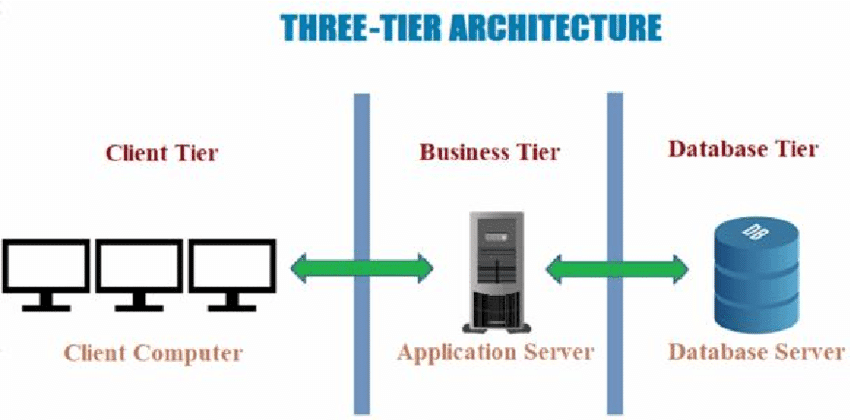

## Launch a RHEL EC2  instance
This instance will serve both as application and web server.  Creat three volumes, each should be 10 GB. Attache all three volumes to the EC2 instance
To begin configuration, open up the terminal of the EC2 web server and check the block devices attached to the server. This is done with the lsblk command. The `lsblk` command is used in Linux and Unix-like operating systems to list information about block devices, such as hard drives and partitions. It provides a clear and concise view of the block devices and their relationships. When you run the `lsblk` command in a terminal, you'll see a hierarchical representation of the block devices on your system, including details like device names, sizes, and mount points. 

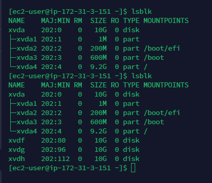

The `df -h` command display information about disk space usage in a more human-readable format. When you run `df -h` in a terminal, it provides a summary of the available disk space, used space, and free space on mounted file systems

## Use the gdisk utility to create partition

Use the gdisk utility to create a single partition on each of the 3 disks by running the commands below.	gdisk provides an interactive interface for partitioning. You can create, modify, or delete partitions using the commands within the gdisk interface. 

`sudo gdisk /dev/xvdf`

`sudo gdisk /dev/xvdh`

`sudo gdisk /dev/xvdg`

To creat new partition, enter n. 

Press enter to choose the default partition number. The default partition is 1

Choose the default partition, 2048GB, and assign the leftover space to last sector

To select the Linux file system, enter the volume’ Hexadecimal code 8300

To print out the partition table Enter “p”

To write the disk, Enter “w”

To save this change and exit the interactive shell, Enter “y”

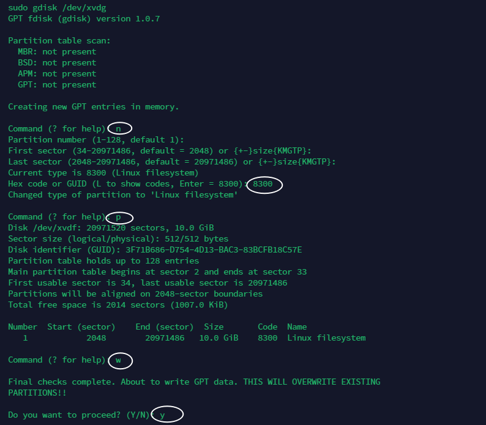

## Install lvm2  Package 

`lvm2` is the Logical Volume Manager. The command sudo yum install `lvm2 -y` is used on RPM-based Linux distributions (such as CentOS and Fedora) to install the Logical Volume Manager (LVM) package. Run 

`sudo yum install lvm2 –y`

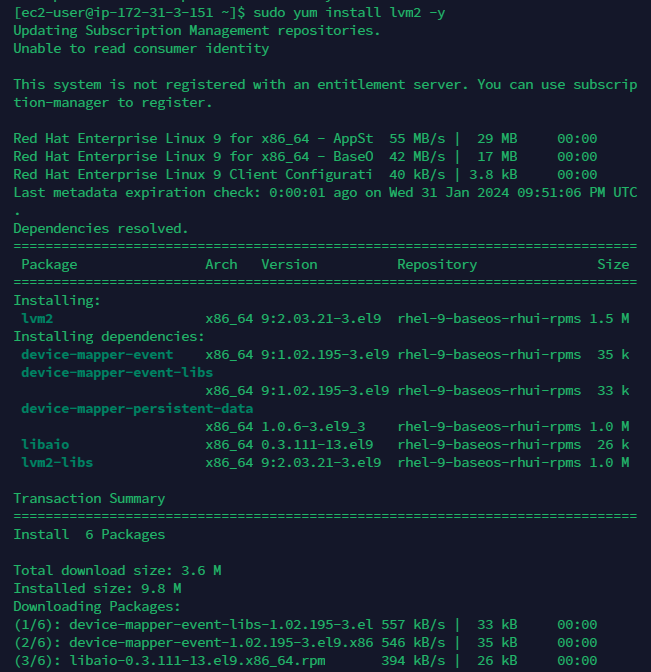

To check for available partitions Run sudo lvmdiskscan command

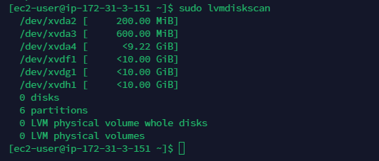

## Initialize a physical volume for use in LVM

Use pvcreate command  to initialize a physical volume for use in LVM

`sudo pvcreate /dev/xvdf1`

`sudo pvcreate /dev/xvdg1`

`sudo pvcreate /dev/xvdh1`

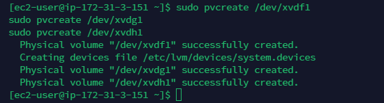

To verify the physical volume has been created, enter `sudo pvs`

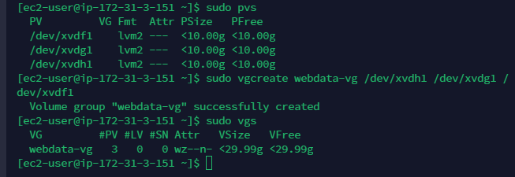

## Create a volume group

Create a volume group  "webdata-vg" and add three physical volumes (/dev/xvdh1, /dev/xvdg1, and /dev/xvdf1) to that volume group. This is done with the vgcreate utility.

Run `sudo vgcreate webdata-vg /dev/xvdh1 /dev/xvdg1 /dev/xvdf1`

After running this command, the "webdata-vg" volume group will be created, and the specified physical volumes will be associated with it.
We can also create logical volumes within this volume group using the lvcreate command

create 2 logical volumes, apps-lv and logs-lv using  lvcreate . While apps-lv will be used to store website data, logs-lv will be used to store log data

`sudo lvcreate -n apps-lv -L 14G webdata-vg`
`sudo lvcreate -n logs-lv -L 14G webdata-vg`

For best practice, its advisable  to allow some free memory. 

Verify with `sudo lvs` `sudo lsblk`

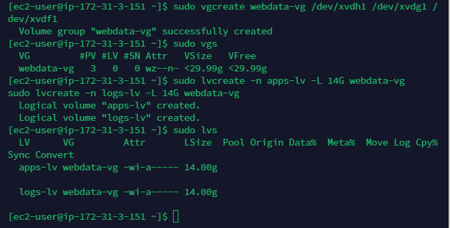

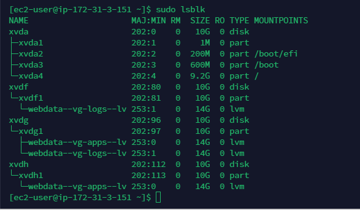

## format the logical volumes with ext4 filesystem using  mks.ext4

`sudo mkfs -t ext4 /dev/webdata-vg/apps-lv`

`sudo mkfs -t ext4 /dev/webdata-vg/logs-lv`

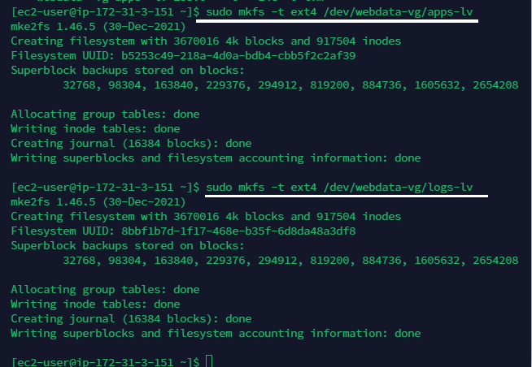

## create /var/www/html and  /home/recovery/logs to store website files and store log data respectively

`sudo mkdir -p /var/www/html`

`sudo mkdir -p /home/recovery/logs`

Mount /var/www/html on apps-lv logical volume

`sudo mount /dev/webdata-vg/apps-lv /var/www/html/
`
Back up all log directory files /var/log into /home/recovery/logs 

`sudo rsync -av /var/log/. /home/recovery/logs/`

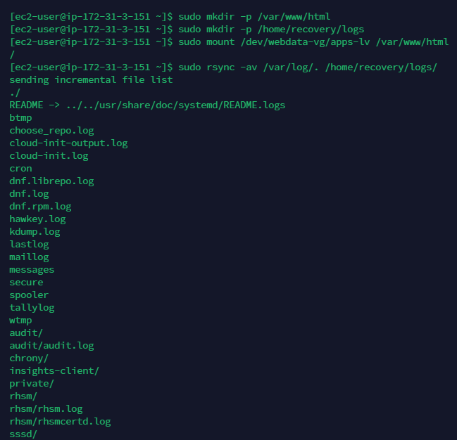

Mount /var/log on logs-v logical volume

`sudo mount /dev/webdata-vg/logs-lv /var/log
`
Restore log files into /var/log

`sudo rsync -av /home/recovery/logs/log/. /var/log`

Run `sudo lsblk` to see the present setup

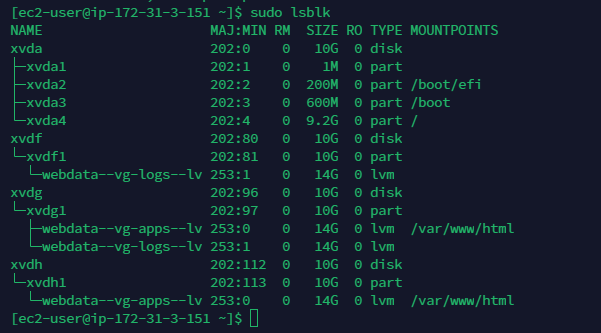

Run `sudo blkid` to use the UUID of the device to update  /etc/fstab/

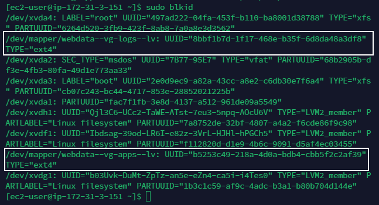

To edit the system file and configure disc drives and partitions and specify mount options
Run `Sudo vi  /etc/fstab`

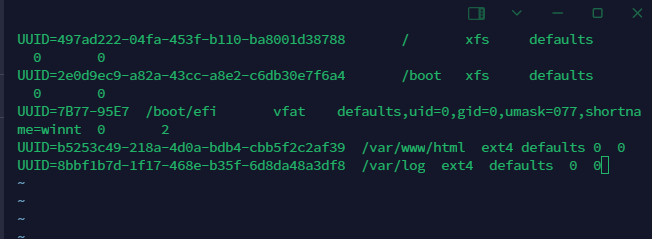

Update /etc/fstab and exit
Do a configuration test and reload daemon
`sudo mount –a`
`sudo systemctl daemon-reload`
To verify set up, run `df -h`

## Prepare the Database Server

Ssh into the db-server and repeat the same steps as for the Web Server, but instead of apps-lv create db-lv and mount it to /db directory instead of /var/www/html/

## Install wordpress on web server

Update the repository

`sudo yum -y update`

Install wget, Apache and it’s dependencies

`sudo yum -y install wget httpd php php-mysqlnd php-fpm php-json`

Start Apache

`sudo systemctl enable httpd`

`sudo systemctl start httpd`

## Install PHP and its Dependencies

`sudo yum install https://dl.fedoraproject.org/pub/epel/epel-release-latest-8.noarch.rpm`

`sudo yum install yum-utils http://rpms.remirepo.net/enterprise/remi-release-8.rpm`

`sudo yum module list php`

`sudo yum module reset php`

`sudo yum module enable php:remi-7.4`

`sudo yum install php php-opcache php-gd php-curl php-mysqlnd`

`sudo systemctl start php-fpm`

`sudo systemctl enable php-fpm`

`sudo setsebool -P httpd_execmem 1`

Restart Apache2  

`sudo systemctl restart httpd`

Make a directory called wordpress, Download word press,  extract the contents and  copy wordpress to  var/www/html

`mkdir wordpress`

`cd   wordpress`

`sudo wget http://wordpress.org/latest.tar.gz`

`sudo tar xzvf latest.tar.gz`

`sudo rm -rf latest.tar.gz`

`sudo cp wordpress/wp-config-sample.php wordpress/wp-config.php
`
`sudo cp -R wordpress /var/www/html/`

## Configure SELInux Policies

First, changes the ownership of the /var/www/html/wordpress , sets the SELinux context of the /var/www/html/wordpress directory and its contents to httpd_sys_rw_content_t , sets the SELinux boolean httpd_can_network_connect to 1, allowing the Apache web server to make network connections.

`sudo chown -R apache:apache /var/www/html/wordpress`

`sudo chcon -t httpd_sys_rw_content_t /var/www/html/wordpress -R`

`sudo setsebool -P httpd_can_network_connect=1` 

## Install MySQL on your DB Server EC2

First update the server, install mysql-server, restart, enable and start mysqld

`sudo yum update -y`

`sudo yum install mysql-server -y`

`sudo systemctl restart mysqld`

`sudo systemctl enable mysqld`

`sudo systemctl start mysqld`

## Create Database and User

Configure DB to work with WordPress
Create a database, a user, and grant privileges for a WordPress installation

Access MySQL Shell

`sudo mysql`

creates a new database named "wordpress" in the MySQL server

`CREATE DATABASE wordpress;`

Create User: creates a new MySQL user named `kelly` identified by the password 'christy123'. The user is allowed to connect from the specified web server's private IP

`CREATE USER `kelly`@`172.31.3.151` IDENTIFIED BY 'christy123';`

Grant Privileges: grants all privileges on the "wordpress" database to the user "kelly" when connecting from the specified web server's private IP address.

`GRANT ALL ON wordpress.* TO 'kelly'@'<Web-Server-Private-IP-Address>';`

Flush Privileges reloads the MySQL server's privileges, applying the changes made by the GRANT statemen

`FLUSH PRIVILEGES;`

#Show Databases: displays a list of all databases on the MySQL server.

`SHOW DATABASES;`

Exit MySQL Shell:

`Exit`

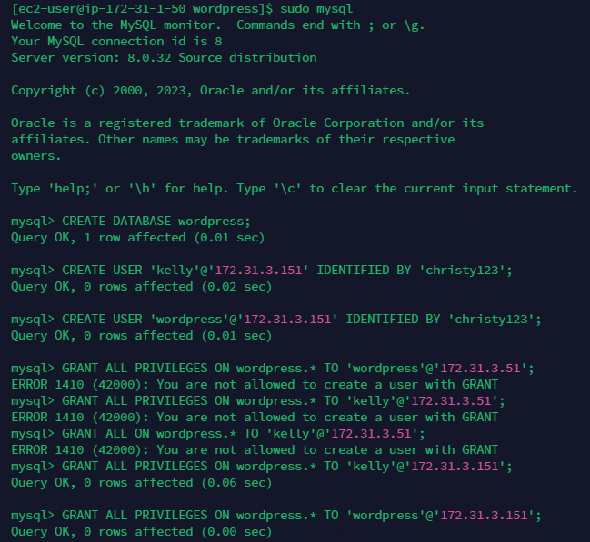

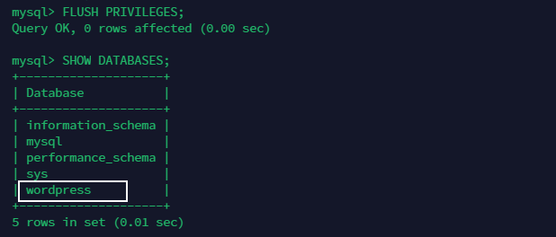

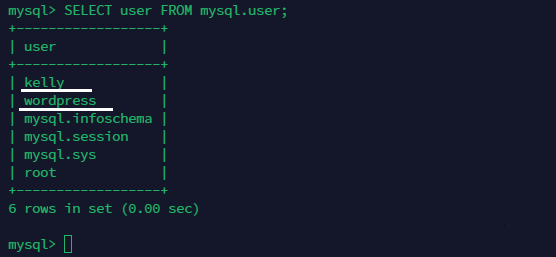

## Configure WordPress to connect to the remote database

On MySql server, edit the inbound rule, open MySql Port 3306. This allows traffic between the database and application server

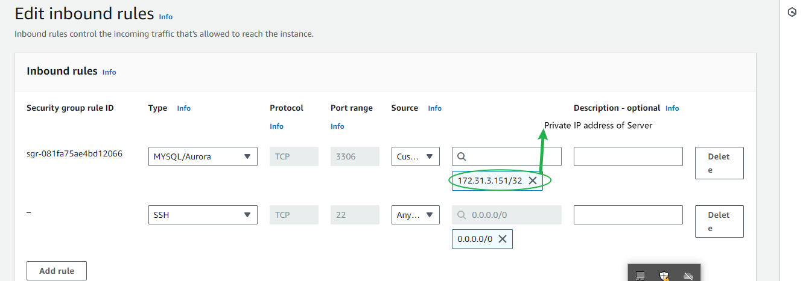

Install MySQL client on the web-server and test that you can connect from your Web Server to your DB server by using mysql-client

Change permissions and configuration so Apache can use WordPress the restart the web server as always

`sudo vi /var/www/html/wordpress/wp-config.php`

Restart Apache

`sudo systemctl restart httpd`

On the webserver, edit the inbound rule and enable TCP Port 80. Enable from either the workstation IP or everywhere 0.0.0.0/0

On your browser, access WordPress through the server IP address.

Login to Wordpress 
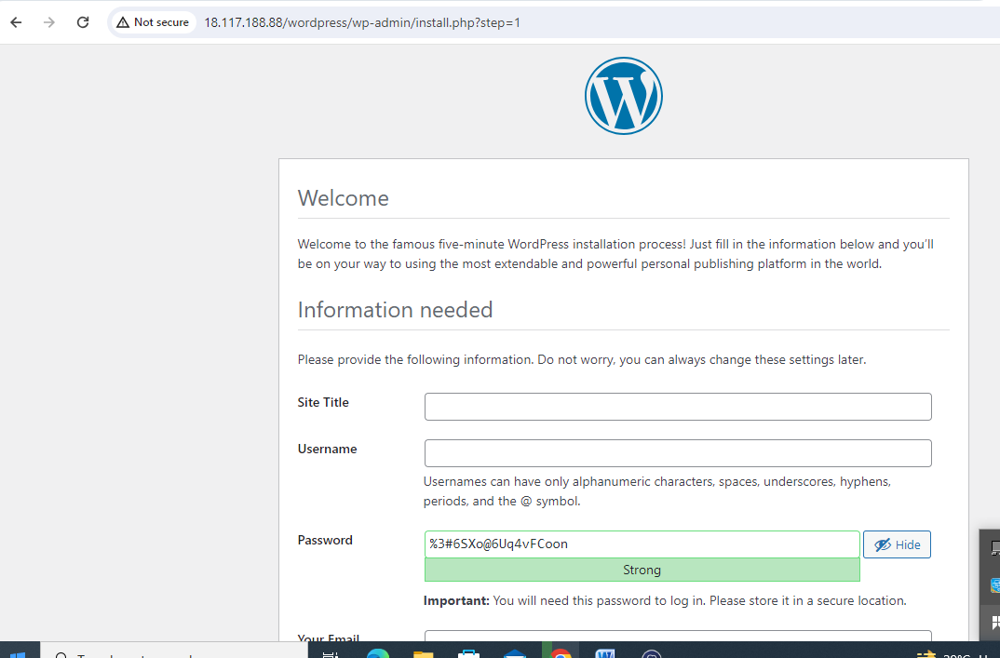
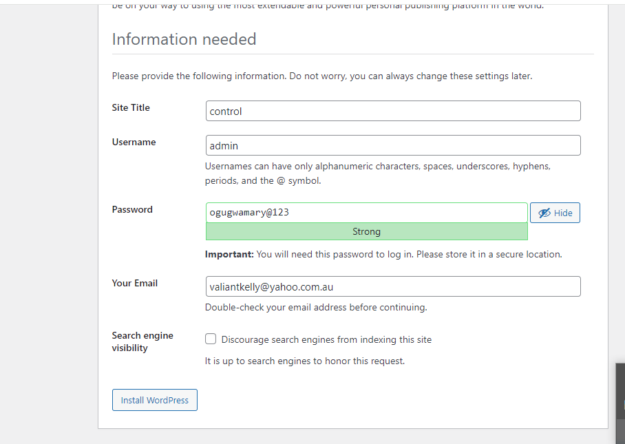
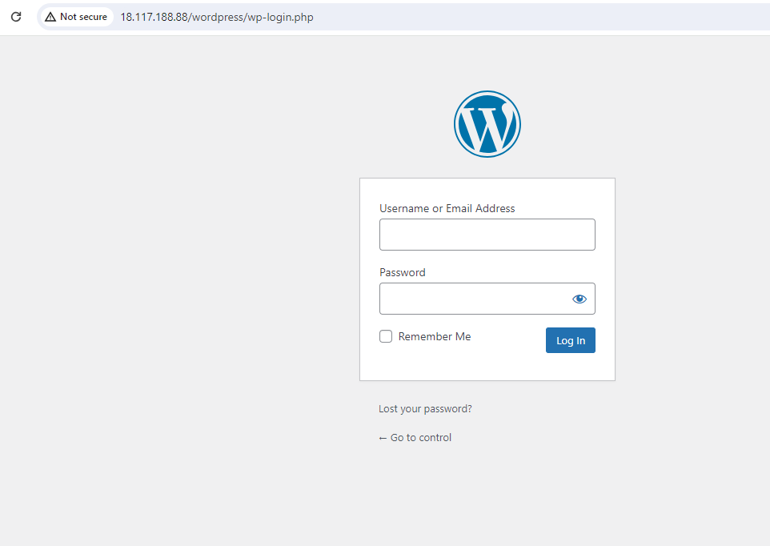
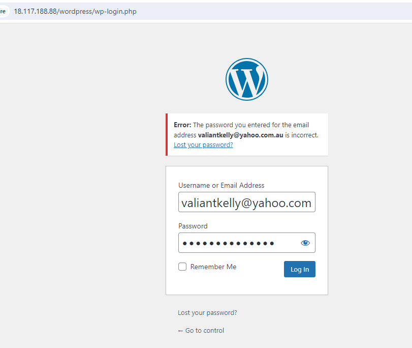

On the menu bar click Tools, Site Health, then info on top of the page to verify the database connection is okay.

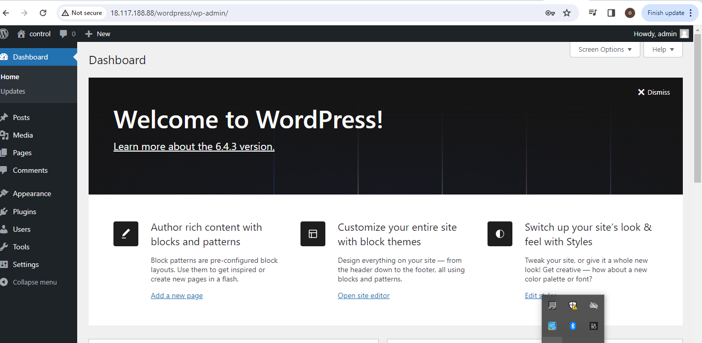
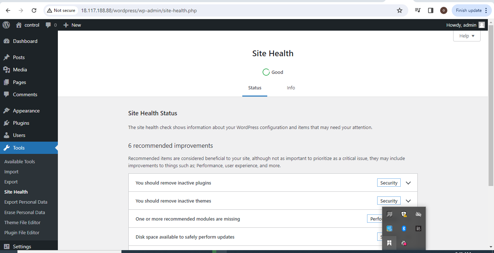

